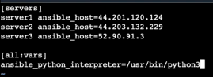

## Ansible
#### Ansible is a configuration management Tools

- Create 1 Ec2 Instance and create 3 alike Ec2 Instance with same KEY
- Connect to 1st EC2 instance 
- Update the instance
- install Ansible 
```bash
	$ sudo apt update
	$ sudo apt install ansible
```
- Copy the Downloaded Private key on you local 
- In Instance create file  
```bash
	$ cd .ssh
    $ vim ansible_key
```
- paste that copied key into it , save and Exit and give the permission to read the file
```bash
$ chmod 700 ~/.ssh

$ chmod 600 ~/.ssh/ansible_key
```


With the help of this we can connect to any Instance created with same key
```bash
$ sudo ssh -i ~/.ssh/ansible_key ubuntu@public_ip
```

Finaly we got connected to other instance
Get back to your master instance (where Ansible is installed)

```bash
$ cat /etc/ansible/hosts
```


can show ( No such file or directory) i.e by default inventoryfile of ansible is here 
No problem You can created your self
```bash
mkdir ansible 
cd ansible
vim hosts
```

```bash
[all:vars]
ansible_python_interpreter=/usr/bin/python3
```
In every server python3 will be an Interpreter is set into the ansible inventory file.

check if the inventory file is correct
```bash
$ ansible-inventory --list -y
```
if thiscommand shows all the list of hosts then its correct otherwise something is wrong it is because there is no inventory at its default location. So we have to pass the path of the inventory file too
```bash
$ ansible-inventory --list -y -i /home/ubuntu/ansible/hosts
```

Module
- Command or set of commands to be executed client side

Trying to ping all server with help of ansible module 
```bash
$ ansible all -m ping -i /home/ubuntu/ansible/hosts --private_key=~/.ssh/ansible_key
```

command to check disk space of all the server 
```bash
$ ansible all -a "free -h" -i /home/ubuntu/ansible/hosts --private-key=~/.ssh/ansible_key
```
servers uptime check
```bash
$ ansible servers -a "uptime" -i /home/ubuntu/ansible/hosts --private_key=~/.ssh/ansible_key
```


***
## Creating and Deploying a Playbook
 

Creating Playbooks

Playbook to create a file
```bash
$ cd /etc/ansible
$ sudo mkdir playbooks
$ cd playbooks/
$ vim create_file.yml
$ sudo vim create_file.yml---

- name: This playbook will create a file
  hosts: all
  become: true
  tasks:
  - name: Create a file
    file:
      path: /home/ubuntu/subscribe.txt
      state: touch
```

Run the Playbook to create a file to all the server
```bash
$ ansible-playbook create_file.yml --private-key=~/.ssh/ansible_key

$ ansible all -a "ls" --private-key=~/.ssh/ansible_key
```
Playbook to  Create User
```bash
sudo vim create_user.yml
```

```bash
---
- name: This playbook will create a user
  hosts: all
  become: true
  tasks:
  - name: To create a user name manish
    user: name=manish
```

```bash
ansible-playbook create_user.yml --private-key=~/.ssh/ansible_key
```


Playbook to Install Docker

```bash
$ sudo vim install_docker.yml
```

```bash
---
- name: This Playbook will install Docker in all the server
  hosts: all
  become: true
  tasks:
  - name: Add Docker GPG apt key
    apt_key:
     url: https://download.docker.com/linux/ubuntu/gpg
     state: present

  - name: Add Docker Repository
    apt_repository:
      repo: deb https://download.docker.com/linux/ubuntu focal stable
      state: present

  - name: Install Docker
    apt:
     name: docker-ce
     state: latest

```

Before Installing the Docker file upgrade all the server
```bash
$ ansible all  -m apt  -a "upgrade=yes update_cache=yes cache_valid_time=86400" --become --private-key=~/.ssh/ansible_key
```

```bash
ansible-playbook install_docker.yml --private-key=~/.ssh/ansible_key
```

Lastly you can check the installation of Docker by Running the ansible Shell module command "Docker --version"
```bash
$ ansible all -m shell -a "docker --version" --private-key=~/.ssh/ansible_key
```